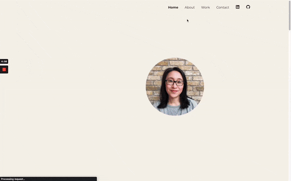

# My Portfolio

This is my personal portfolio website built with TypeScript, React and TailwindCSS. 
- <a href= "https://hjkang.pages.dev/" target="_blank"> Portfolio </a>

## Features
- Responsive design optimized for desktop and mobile devices
- Interactive navigation menu with smooth scrolling to page sections
- Description of my background and relavant skills as a software developer
- Display of projects with links to demos and code repositories
- Contact form for visitors to send messages

------------------

## Author

👤 **HJ Kang** 
- GitHub [@cocomarine](https://github.com/cocomarine) 
- LinkedIn [@hj-kang07](https://www.linkedin.com/in/hj-kang07/) 

